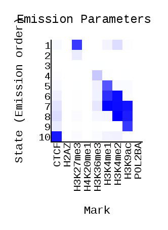
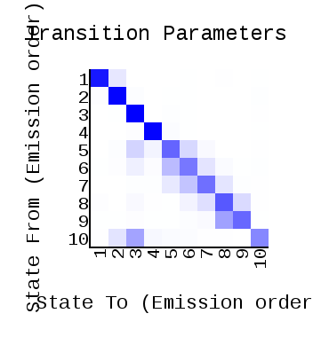
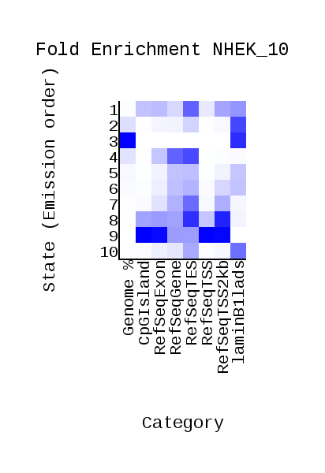
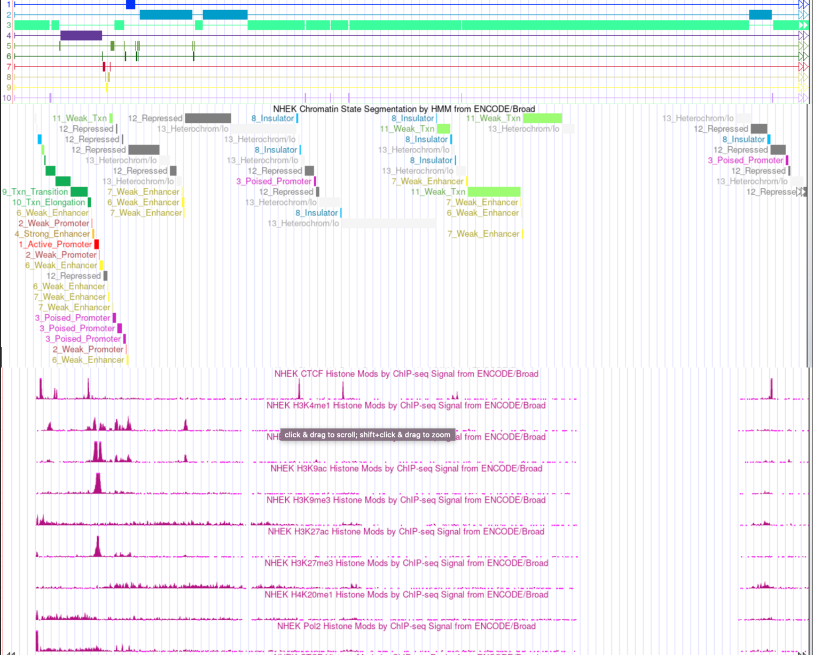

# HW3

[Colab](https://colab.research.google.com/drive/1uy-JVVWgb2PwijgPcr8YDp3GtSLAPfaz?usp=sharing)

## Emission

## Transition

## Overlap Enrichment

## Список меток
| Метка  |
| ------ |
| H4K20me1 |
| H3K9ac |
| H3K4me1 |
| CTCF |
| H3K27me3 |
| H3K36me3 |
| H3K4me2 |
| H2AZ |
| H4K20me1 |
| POL2BA |

## Геномный браузер

## Таблица эпигенетических типов
| Тип и название  | Характерные метки |
| ------------- | ------------- |
| 1. Active promoter | H3K4me1 H3K9me3 |
| 2. Weak promoter | H3K9me3 H3K4me1 |
| 3. Poised promoter | H3K4me1 H3K9me3 |
| 4-5. Strong Enhancer | H3K4me1 H3K9me3 H3K4me2 |
| 6-7. Weak enhancer | H3K4me1 H3K9me3 H3K4me2 |
| 8. Insulator | CTCF H3K9me3 |
| 9. Transition | CTCF H3K4me1 H3K9ac H4K20me1 |
| 10. Elongation | H3K4me1 H3K9me3 H4K20me1 |
| 11. weak transcribed | H3K4me1 H3K9me3 |
| 12. Repressed | НЗК9ас H3K9me3 H3K27ac H3K27me3 |
| 13. Heterochrom | H3K9me3 H3K27me3 |
